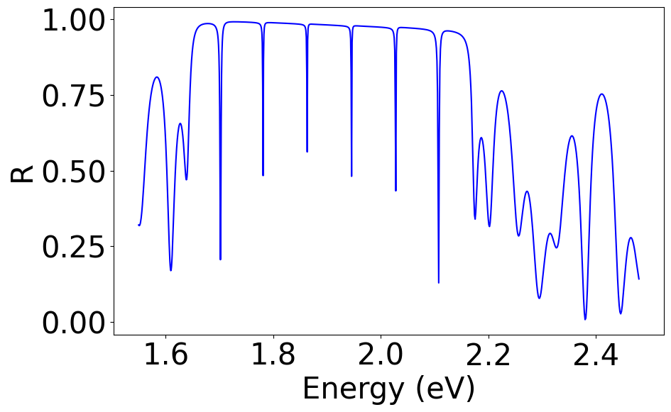
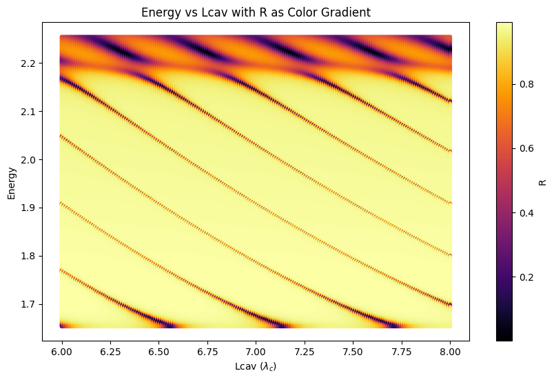

# TMM Simulation Toolkit

**Author:** [Fito-22](https://github.com/Fito-22)  
**Group:** [QOSS](https://github.com/PicosLab/QOSS)  
**Institution:** Universidad Autónoma de Madrid (UAM)  
**Year:** 2024  
**Supervisor:** Dr. Carlos Antón Solanas  

This repository contains a set of tools developed for Transfer Matrix Method (TMM) simulations of optical microcavities. It was created within the QOSS research group at UAM as part of a project focused on photonic simulations.

## 📁 Project Structure

- `functions.py`:  
  Contains all functions used to **calculate**, **simulate**, and **plot** relevant parameters for microcavity studies.  
  > ⚠️ **Note:** You must customize the cavity structure in the `CohTMM` main calculator as described in the `Notebook.ipynb`.

- `layers.py`:  
  Includes predefined layer materials that can be used to build your desired cavity structures.

- `main.py`:  
  A script to calculate and **save the key optical parameters** of the cavity for different configuration combinations (e.g., number of mirror pairs, cavity thickness, etc.).

- `Notebook.ipynb`:  
  A step-by-step **Jupyter Notebook** guide with explanations and examples on how to run your own simulations using the provided tools.

## 📊 Some Results

Below are examples of typical outputs generated by this simulation toolkit:

| Structure Profile | Reflectivity |
|-------------------|--------------|
|  |  |

| Dispersion | Modes vs Cavity Length |
|------------|------------------------|
|  |  |
---

Feel free to fork, contribute, or use this toolkit for your own research and simulations!
